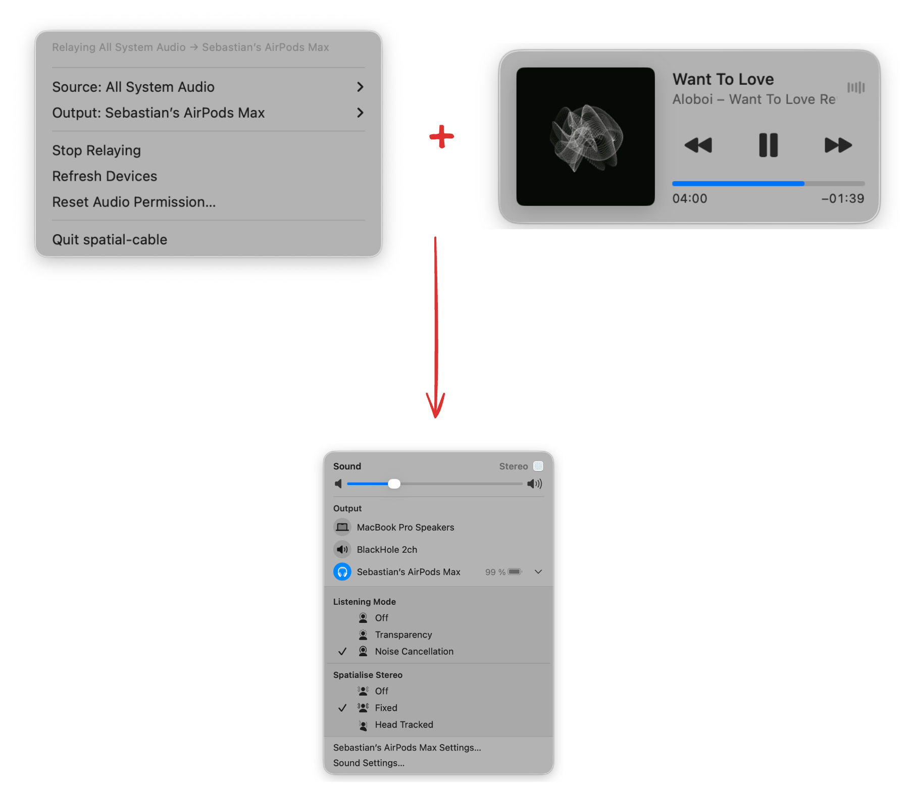

# spatial-cable

Menu bar app that relays system/app audio through Core Audio process taps to trigger native macOS spatialization. Allows the use of Spatial Audio features in Fixed or Head Tracking mode with select apps or all apps on your Mac. Works with Chrome or Spotify which run on Chromium and do not yet support the Spatial Audio stack.

## Build

**Running with XCode**

Open `spatial-cable.xcodeproj` in Xcode, set your own Team under Signing & Capabilities, then ⌘R.

**Build app from source**

Run ./build.sh and drag the app to Applications

## Known Issues

There's a detune when you switch between Fixed and Head Tracking mode while listening to audio. This is caused by samples being dropped, causing a timing issue. Resolves itself within 1s. 